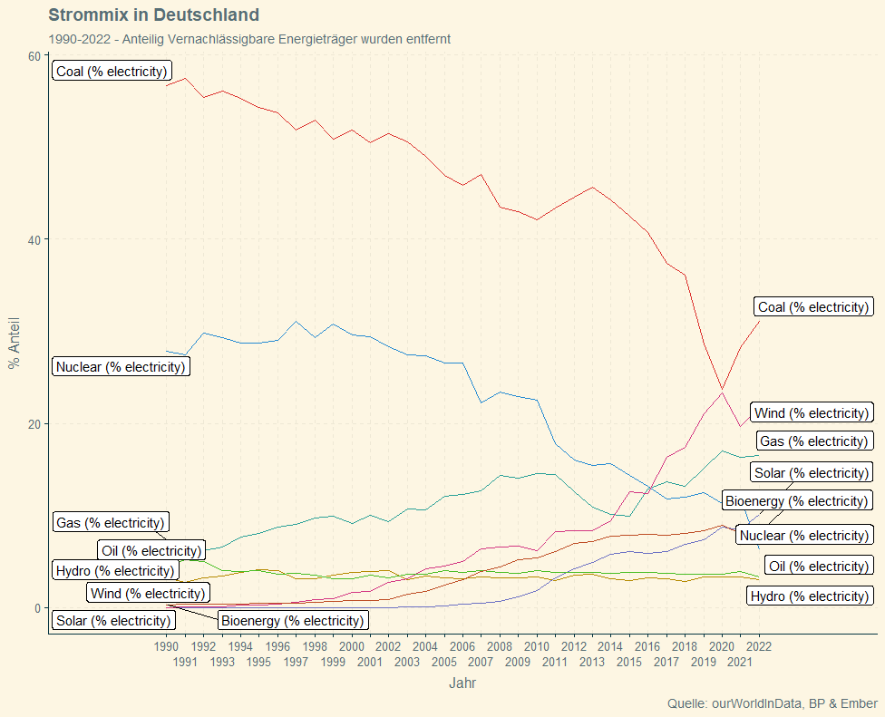
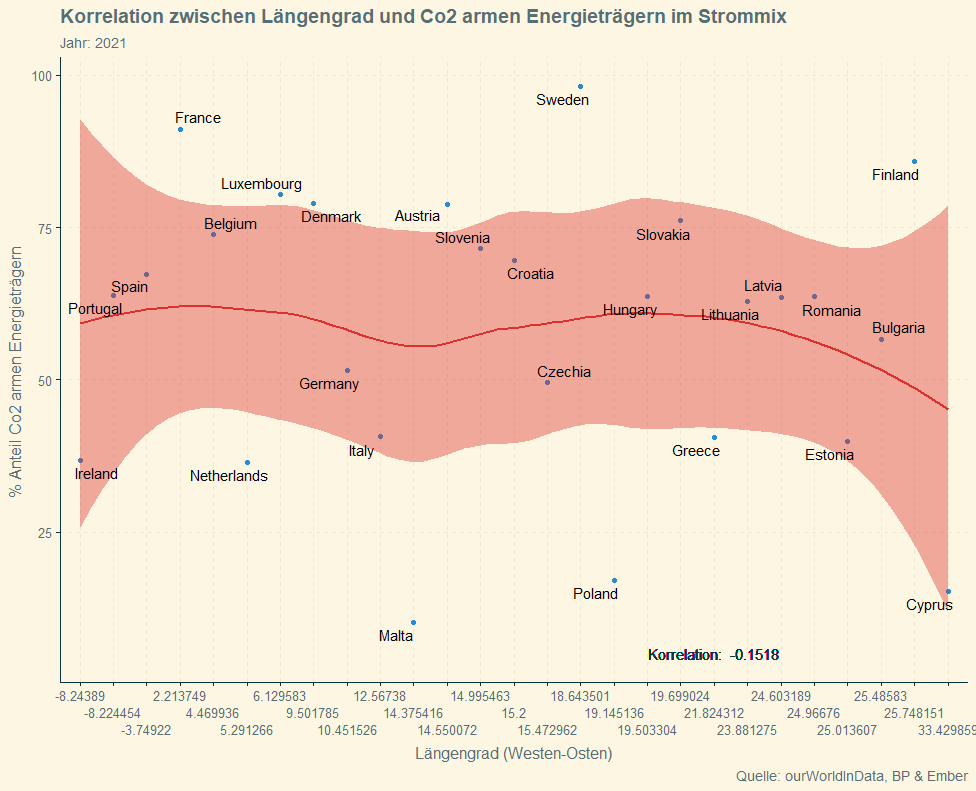
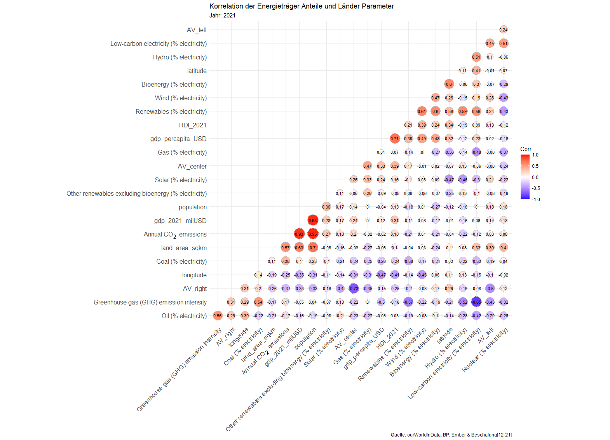

# ModDataScience
Code, Data Files and Graphes for my Data Science Course

Files:

testScript.r: R File for processing, merging and ploting

dataMasterFile.csv includes all Data gathered in one Place.

"plots"-Folder: All Plots made for the Project

## Some Example Graphs

Sources:

[1] 
Electricity Data Source: Hannah Ritchie, Max Roser and Pablo Rosado (2022) - "Energy". Published online at OurWorldInData.org. Retrieved from: 'https://ourworldindata.org/energy' 

[2] 
https://ec.europa.eu/eurostat/en/

[3] 
https://ec.europa.eu/eurostat/databrowser/explore/all/envir?lang=en&subtheme=nrg.nrg_quant&display=list&sort=category

[4] 
https://european-union.europa.eu/principles-countries-history/key-facts-and-figures/life-eu_en

[5] 
https://developers.google.com/public-data/docs/canonical/countries_csv

[6] 
https://data.worldbank.org/indicator/NY.GDP.MKTP.CD?locations=EU

[7] 
https://data.worldbank.org/indicator/NY.GDP.PCAP.CD

[8]
https://www.statista.com/statistics/933977/human-development-index-of-european-countries/

[9]
Armingeon, Klaus, Sarah Engler and Lucas Leemann. 2022.
Comparative Political Data Set 1960-2020.
Zurich: Department of Political Science, University of Zurich.
https://www.cpds-data.org/index.php/data

[10]
https://ourworldindata.org/grapher/annual-co2-emissions-per-country?facet=none&country=~OWID_WRL
Basierend auf Daten von https://www.globalcarbonproject.org/

[11] 
https://www.eea.europa.eu/data-and-maps/daviz/co2-emission-intensity-13#tab-googlechartid_chart_11]
